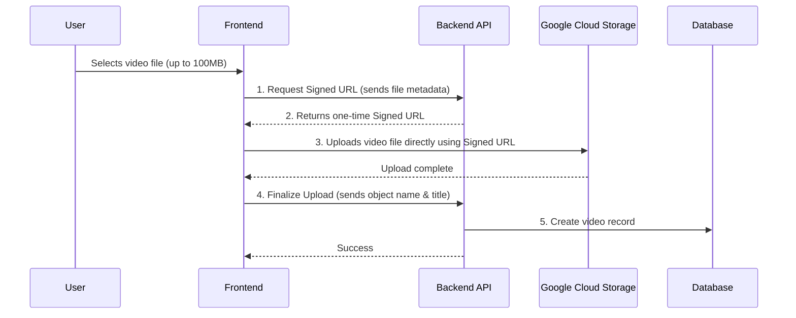

# Mini YouTube

[Mini YouTube](https://wesley-yt.web.app/)

A full-stack Mini YouTube featuring video uploads, commenting, and user authentication. Built with a Go backend and a React frontend, designed for scalable deployment on Google Cloud.

---

## Technology Stack

| Area      | Technology                                                                                             |
| :-------- | :----------------------------------------------------------------------------------------------------- |
| **Backend** | [Go](https://golang.org/), [Gin](https://gin-gonic.com/), [GORM](https://gorm.io/), [PostgreSQL](https://www.postgresql.org/) |
| **Frontend**| [React](https://reactjs.org/), [TypeScript](https://www.typescriptlang.org/), [Vite](https://vitejs.dev/), [Tailwind CSS](https://tailwindcss.com/) |
| **Database**| [Supabase](https://supabase.io/) (PostgreSQL)                                                          |
| **Deployment**| [Docker](https://www.docker.com/), [Google Cloud Run](https://cloud.google.com/run), [Firebase Hosting](https://firebase.google.com/docs/hosting) |
| **Auth**    | [Firebase Authentication](https://firebase.google.com/docs/auth)                                       |
| **Storage** | [Google Cloud Storage](https://cloud.google.com/storage)                                               |

---

## Architecture

This project is a monorepo containing two separate applications: a backend API and a frontend web client. This separation of concerns allows for independent development, scaling, and deployment.

-   **Backend:** A Go API built with the Gin framework, deployed as a container to **Google Cloud Run**. It handles business logic, database interactions, and **orchestrates large file uploads** by generating secure, signed URLs.
-   **Frontend:** A React application built with Vite, deployed as a static site to **Firebase Hosting**. It provides the user interface and interacts with the backend API.
-   **Database:** A **Supabase PostgreSQL** instance is used as the primary data store for user information, video metadata, comments, and likes.
-   **Authentication:** **Firebase Authentication** is used to manage user identities and secure the backend API.
-   **File Storage:** Video files are uploaded **directly** from the client to **Google Cloud Storage** using the secure signed URL provided by the backend. This approach is highly scalable and avoids backend server limitations.

### Video Upload Flow

The architecture for handling large file uploads follows a modern, scalable pattern to avoid hitting server request size limits.

---

## Features

-   **User Authentication:** Secure login and registration using Firebase Authentication.
-   **Large Video Uploads:** Users can upload video files (up to 100MB) directly to a secure storage bucket.
-   **Video Playback:** Stream videos directly from Google Cloud Storage.
-   **Commenting System:** Real-time comments on videos using WebSockets.
-   **Video Discovery:** Browse a list of all uploaded videos.
-   **Like System:** Users can like and unlike videos.

---

## API Endpoints

All endpoints are prefixed with `/v1`.

| Method | Endpoint                       | Description                                                              | Auth Required |
| :----- | :----------------------------- | :----------------------------------------------------------------------- | :------------ |
| `POST` | `/auth/login`                  | Logs in a user with Firebase credentials.                                | No            |
| `POST` | `/auth/check-username`         | Checks if a username is available.                                       | No            |
| `POST` | `/auth/register`               | Registers a new user.                                                    | No            |
| `GET`  | `/profile`                     | Gets the profile of the current user.                                    | Yes           |
| `GET`  | `/videos`                      | Retrieves a paginated list of videos.                                    | No            |
| `POST` | `/videos/initiate-upload`      | **Generates a secure URL for direct video upload to GCS.**               | Yes           |
| `POST` | `/videos/finalize-upload`      | **Confirms successful upload and creates the video record in the DB.**   | Yes           |
| `GET`  | `/videos/:id`                  | Retrieves details for a single video.                                    | No            |
| `POST` | `/videos/:id/view`             | Increments the view count for a video.                                   | No            |
| `POST` | `/videos/:id/like`             | Toggles a like on a video.                                               | Yes           |
| `GET`  | `/videos/:id/comments`         | Retrieves all comments for a video.                                      | No            |
| `POST` | `/comments`                    | Creates a new comment on a video.                                        | Yes           |
| `GET`  | `/ws/comments?vid=<id>`        | Establishes a WebSocket for comments.                                    | No            |

---

## License

This project is licensed under the MIT License. See the [LICENSE](LICENSE) file for details.
